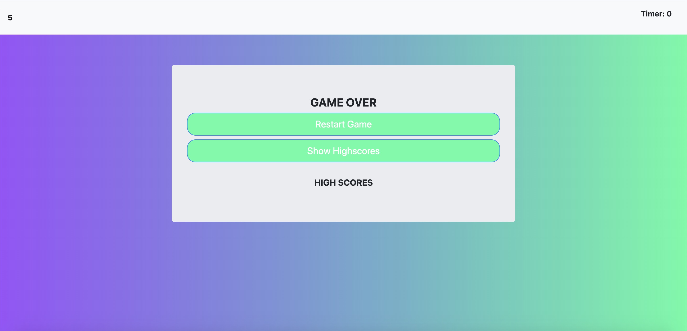

# Code Quiz

This is an application I built called Code Quiz that allows the user to take a quiz on topical code questions.

1. User selects their answers by clicking buttons.
2. If the right answer is selected the user gets 1 point.
3. If the wrong answer is selected the timer deducts 10 seconds.
4. The user can see their high score by clicking the high score button.

Link to live site: [Code Quiz](https://portercol.github.io/Code-Quiz/)

# Credits

1. Bootstrap CDN
2. jQuery CDN
3. Peers from study groups + TA's/Tutors